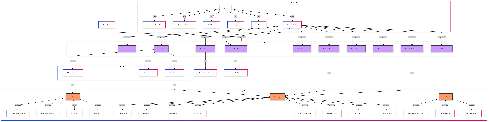

# React Native Safety Manager App

## 프로젝트 설명

이 프로젝트는 React Native를 사용하여 안전 관리자들이 법률 안내와 안전 교육 정보를 쉽게 찾고 이용할 수 있도록 돕는 애플리케이션입니다. 프로젝트는 Node.js 버전 18.17.0을 기반으로 합니다.

## 주요 기능

1. **법률 안내의 부족으로 인한 문제 해결**
   - 안전 관리자들이 법률 안내 정보를 쉽게 찾을 수 있도록 지원합니다.
2. **안전 교육 정보의 부족 해결**
   - 다양한 안전 교육 업체를 검색하고, 적합한 교육을 받을 수 있도록 돕습니다.

## 기술 스택

- **React Native**: 모바일 애플리케이션 개발
- **Node.js**: 백엔드 서버 (버전 18.17.0)
- **Redux**: 상태 관리
- **React Navigation**: 네비게이션
- **Axios**: API 요청
- **Sentry**: 오류 추적 및 모니터링
- **Firebase Messaging**: 푸시 알림
- **Notifee**: 로컬 및 푸시 알림 관리
- **Day.js**: 날짜 및 시간 처리

## 사용된 라이브러리

- `@react-native-firebase/messaging`: Firebase 클라우드 메시징
- `@notifee/react-native`: 알림 관리
- `@sentry/react-native`: 오류 추적
- `@tanstack/react-query`: 서버 상태 관리
- `axios`: HTTP 클라이언트
- `dayjs`: 날짜 및 시간 라이브러리
- `react-native-bootsplash`: 앱 부트 스플래시 화면
- `@react-navigation/native`: 네비게이션 라이브러리
- `@react-navigation/native-stack`: 스택 네비게이션

## 프로젝트 구조



## 설치 및 실행 방법

### 요구 사항

- Node.js 버전 18.17.0
- npm 또는 yarn

### 설치

1. **리포지토리 클론**

   ```sh
   git clone https://github.com/your-repository.git
   cd your-repository
   ```

2. **패키지 설치**

   ```sh
   npm install
   ```

   또는

   ```sh
   yarn install
   ```

3. **iOS 설정**
   ```sh
   cd ios
   pod install
   cd ..
   ```

### 실행

1. **안드로이드**

   ```sh
   npx react-native run-android
   ```

2. **iOS**
   ```sh
   npx react-native run-ios
   ```
